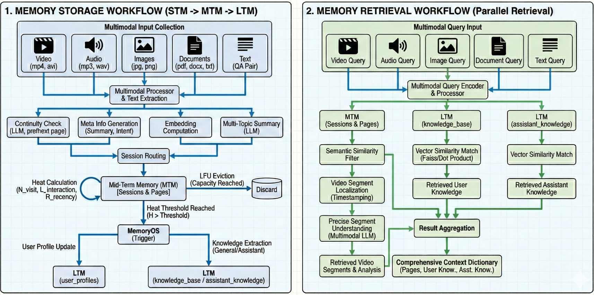

# 🧠 ContextBase: 下一代多模态Agent记忆框架

<div align="center">


**首个为 AI Agent 打造的“全模态”记忆框架**

*存万物 · 查万物 · 帧级定位*

[English](README.md) • [核心特性](#-核心特性) • [架构设计](#-架构设计) • [应用场景](#-应用场景)

</div>

---

## 📖 简介

**ContextBase 致力于为 AI Agent 构建一个持久化、高保真、可进化的“第二大脑”。**

现有的 Memory 框架大多强行将丰富多彩的物理世界压缩为纯文本，导致了视觉细节丢失和上下文的时序错位。**ContextBase 拒绝这种降维压缩。** 

ContextBase是**多模态原生 (Multi-modal Native)** 的记忆框架，旨在以原始的高保真形式处理视频、音频和文档流。无论是数百小时的影视素材库，还是画面背景里隐藏的一个细微彩蛋，ContextBase 都能完成从**全模态数据输入**、**流式存储**到**帧级检索**的高精度闭环。

我们构建的不是静态数据库，而是 Agent 的**原生时空感知**。

---

## ✨ 核心特性

### 1. ♾️ 全模态存储与检索
**超越 Text-to-Text 的限制** ContextBase 统一了异构数据的处理范式。
* **输入:** 统一处理视频、音频、图像、文档及文本。
* **多模态原生索引:** 采用“并行检索工作流”，直接对视觉和听觉信号建立向量索引，而非仅仅依赖其文字描述。
* **跨模态检索:** 支持“以图搜视”、“以音搜文”。

### 2. 🎞️ 无限流处理
**忘掉对有限上下文窗口的焦虑**
* 专为 **长上下文数据** 和 **24/7 持续运行** 的 Agent 设计。
* 支持无限时长的视频和连续音频流录入。
* **动态分块:** 内置连续性检查机制，在处理海量会议记录、影视剧集或监控流时，确保记忆上下文不发生断裂。

### 3. 🎯 0.1秒级时空精定位
**停止对时间戳的幻觉**
* 传统RAG与Memory系统只能告诉你“答案在哪个文件”，ContextBase 能告诉你**“答案在第几分第几秒”**。
* **SOTA 级精度:** 能够以 **0.1 秒的精度** 检索并定位视频/音频片段。
* **价值:** 返回结果不再是臃肿的1GB文件，而是精确命中的0.1秒级关键片段，实现真正的“大海捞针”。

---

## 🏗️ 架构设计

ContextBase 借鉴了人类大脑的认知过程以及操作系统的存储结构，采用了分层存储架构配合双路检索引擎。

<div align="center">
  
</div>

### 🧠 记忆生命周期
数据流经仿生的处理管道：
1.  **多模态输入:** 统一处理器从异构数据中提取多维特征。
2.  **STM (短期记忆):** 处理即时上下文流，执行 Embedding 计算与初步过滤。
3.  **MTM (中期记忆):** 基于会话的缓冲区，引入**热度计算算法 (Heat Calculation)**。系统根据访问频次 ($N_{visit}$)、交互深度 ($L_{interaction}$) 和新近度 ($R_{recency}$) 动态评判数据价值。
4.  **LTM (长期记忆):** 高热度信息“结晶”为永久存储（用户画像 & 知识库），低价值数据则被从工作记忆中淘汰。

### 🔍 精准检索引擎
支持自然语言、图像、视频片段等多种查询形式：
1.  **语义过滤:** 快速从 MTM 中筛选相关会话上下文。
2.  **向量相似度匹配:** 在 LTM 知识库中进行深度全库扫描。
3.  **时空定位:** 执行高精度的帧级定位，锁定具体数据片段。
4.  **结果聚合:** 将检索到的视频切片、背景知识和对话历史等上下文融合为结构化的上下文列表返回给Agent。

---

## 🚀 应用场景

### 1.真正“懂你”的伴侣型 Agent
* **痛点:** 现在的 Chatbot 聊完就忘。你上周说“我在减肥”，今天它还给你推荐高热量餐厅；你三个月前提到过“讨厌香菜”，它现在完全不记得。
* **ContextBase 的记忆体现:**
    * **LTM (长期记忆 - 画像进化):** 当你曾在多次对话中通过语音或文本流露过对“低糖饮食”的偏好，系统会自动将这一**高热度信息**结晶化，写入 `User Profile`。
    * **记忆回溯:** 当你今天问“中午吃什么？”，Agent 不会随机推荐，而是调用 **LTM**：“记得你正在**生酮饮食期间（长期记忆）**，且上周五（中期记忆）你提到想试那家新开的沙拉店，但当时排队太长没去成，要不今天试试？”
    * **价值:** 从“一问一答”进化为**跨越时间周期的主动关怀**。

### 2.长周期项目的一体化大脑
* **痛点:** 在一个长达半年的项目中，早期的会议录音、白板草图和现在的代码文档是割裂的。你很难问 AI：“我们现在的方案和两个月前第一次头脑风暴时的想法有什么偏差？”
* **ContextBase 的记忆体现:**
    * **MTM (中期记忆 - 热度召回):** 虽然“第一次头脑风暴”是两个月前的 Session，但因为那是项目起点，**访问频次 ($N_{visit}$)** 高，它在 MTM 中一直保持“温热”状态，未被遗忘。
    * **跨模态验证:** Agent 能够同时调取两个月前的白板照片（视觉记忆）和当时的会议录音（听觉记忆），与现在的设计文档（文本输入）进行比对。
    * **价值:** 连接孤立的时间切片，防止项目“初心”遗忘，提供跨越数月的一致性监督。

### 3.伴随式学习导师
* **痛点:** 传统教育 AI 不知道你的学习曲线。它不知道你 5 分钟前刚在某个知识点上卡住了，也不知道你 3 天前在另一个相关视频里已经学懂了基础概念。
* **ContextBase 的记忆体现:**
    * **STM (短期记忆 - 上下文感知):** 此时此刻，当你对着题目皱眉（摄像头捕捉到表情或听到叹气），STM 捕捉到你的困惑。
    * **知识关联:** Agent 检索 **LTM** 发现你曾在一个月前的视频课程中，在“微积分链式法则”这个点上停留了很长时间（高交互深度 $L_{interaction}$）。
    * **主动干预:** “看起来你在这个步骤卡住了。这和我们上个月（记忆回溯）复习的‘链式法则’很像，还记得当时那个红色的球体演示动画吗？我帮你调出来。”
    * **价值:** 建立学习历史的连续性，提供**因材施教的个性化辅助**。

### 4. 🏠 智能家庭的“管家记忆” 
* **痛点:** 智能音箱只能执行指令，没有家庭历史感。
* **ContextBase 的记忆体现:**
    * **情节记忆:** 用户：“我想看上次过年大家一起包饺子时的那个视频，好像是奶奶在教我捏褶子。”
    * **复杂语义定位:** 系统不是去搜文件名，而是理解“过年（时间范畴）”、“大家（多人物识别）”、“包饺子（动作识别）”、“奶奶教我（交互关系）”。
    * **高精度呈现:** 直接定位并播放**那段 30 秒的温馨片段**，而不是把整整 2 小时的家庭录像丢给你。
    * **价值:** 存储家庭的高光时刻，而不仅仅是存储冷冰冰的文件。

---

## ⚡ 快速开始

1) 环境  
- Python 3.9+  
- （可选）创建虚拟环境：`python -m venv .venv && source .venv/bin/activate`（PowerShell: `.\.venv\Scripts\Activate`）

2) 安装依赖  
```bash
pip install -r requirements.txt
```

3) 配置密钥  
```bash
export OPENAI_API_KEY=你的密钥             # 必填
export OPENAI_BASE_URL=https://api.openai.com/v1  # 可选，自定义网关时设置
```

4) 最小示例  
```python
from memcontext import Memcontext

mem = Memcontext(
    user_id="demo_user",
    openai_api_key=os.environ["OPENAI_API_KEY"],
    data_storage_path="./data",             # 数据持久化目录
    openai_base_url=os.getenv("OPENAI_BASE_URL"),
)

# 添加一条对话记忆
mem.add_memory(
    user_input="我最近在学多模态 RAG",
    agent_response="好的，我会记录你的学习偏好。",
    meta_data={"source": "demo"}
)

# 检索上下文
ctx = mem.retrieve_context(user_query="再帮我回顾下上次学的内容？")
print(ctx)
```

5) 运行 Demo 界面（Flask）  
```bash
cd memdemo
pip install -r requirements.txt
python app.py    # 默认端口 5000
```

## 🤝 贡献指南

ContextBase 的核心功能正在紧锣密鼓地开发中。如果你对多模态、RAG 或 Agent Memory 系统感兴趣，欢迎 Star 并关注我们的进展。

## 📜 协议

Apache 2.0